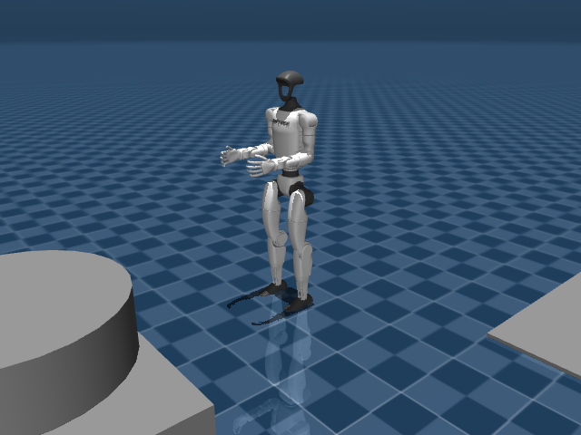

# G1 Isaac Sim RL

**Reinforcement Learning** training and simulation for the **Unitree G1 humanoid robot** using NVIDIA Isaac Sim and Isaac Lab. Includes custom training scripts, manipulation tasks, and a layered control architecture.

<p align="center">
  
</p>

## Features

- RL policy training for G1 humanoid locomotion and manipulation
- Custom Isaac Lab task environments for G1
- Layered control architecture (high-level planning + low-level control)
- Energy consumption tracking and analysis
- Manual control interface for teleoperation testing

## Project Structure

```
training/
    train_g1.py         # RL training script
    play_g1.py          # Policy playback and evaluation
    debug_g1.py         # Debug visualization
    track_energy.py     # Energy consumption analysis
simulation/
    robots/             # G1 robot definitions
    tasks/              # Custom task environments
    action_provider/    # High-level action generation
    layeredcontrol/     # Layered control system
    sim_main.py         # Main simulation entry point
    manual_control.py   # Teleoperation interface
data/
    energy_log_factory_run1.csv  # Training metrics
```

## Prerequisites

- NVIDIA Isaac Sim 4.5
- NVIDIA Isaac Lab
- Python 3.10+
- PyTorch with CUDA

## Installation

```bash
git clone https://github.com/SkullsEye/G1-Isaac-Sim-RL.git
cd G1-Isaac-Sim-RL
```

## Usage

```bash
# Train G1 policy
python training/train_g1.py

# Play trained policy
python training/play_g1.py

# Manual control
python simulation/manual_control.py

# Track energy consumption
python training/track_energy.py
```

## Author

**Umar Bin Muzzafar**
B.Tech in Artificial Intelligence and Robotics, Dayananda Sagar University, Bangalore

## License

MIT License. See [LICENSE](LICENSE) for details.
